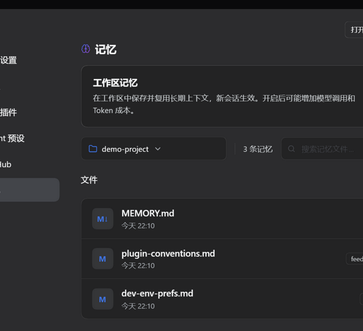

# dsh-memory — ZCode 记忆的 DSH 移植插件

把 ZCode 的持久记忆机制移植成 DeepSeek Harness（DSH）的 cordis 插件：
每个 workspace 一份 Markdown 记忆库 + MEMORY.md 索引召回 + 记忆工具 + 回合后自动提取 + 设置页管理区。



## 与 ZCode 的对齐点

| ZCode | dsh-memory |
|---|---|
| `<cli存储>/memories/projects/<slug>-<hash16>/memory/*.md` + `MEMORY.md` | `<DSH_HOME>/memories/projects/<basename>-<sha16>/memory/`（同构布局，可改 `memoriesRoot`） |
| frontmatter `name/description/metadata.type: user\|feedback\|project\|reference` | 完全一致的 4 类与字段 |
| MEMORY.md 索引注入 meta-user 上下文 | `agent.inject()`（同样不唤醒，落进下一个被接纳步骤） |
| 模型用 Write/Edit 直写记忆目录 + 提示词规约 | 显式 `memory_write`/`memory_list`/`memory_read` 工具 + 提示词规约 |
| 每回合 TurnComplete 后提取子代理 | `turn/end` 持久事件后单次 `ctx.llm.stream` 提取（复用会话最近路由） |
| 提取盖 `originSessionId` 戳 | 同 |
| 设置页记忆管理（开关/文件列表/日期/查看） | 设置页「记忆」分区：开关 + 自绘工作区下拉 + 搜索 + 行内展开查看 + 资源管理器定位 |

## 安装

方式一（git）：

```powershell
git clone https://github.com/One1turn/dsh-memory-plugin.git
& "$env:LOCALAPPDATA\Programs\DeepSeek Harness\1\resources\runtime\cli\bin\dsh.cmd" plugin --profile desktop add -w link:<克隆路径>
```

方式二（zip）：下载 Releases/zip 解压后，把上面的 `<克隆路径>` 换成解压路径。

方式三（会话内）：让 DSH 的 Agent 用 `plugin_manager` → `install_bundle` 安装解压路径。

装完**重启 DSH**，设置页出现「记忆」分区。

## 会话内能力

- `memory_write {title, description, type, body}` — 落一条记忆（自动更新 MEMORY.md 索引）
- `memory_list {workspace?}` — 列出当前工作区记忆
- `memory_read {file, workspace?}` — 读某条记忆全文
- 回合结束（`turn/end`）自动提取：复用该会话最近的 provider/model 路由，单次 LLM 调用产出 JSON 写入，盖 `originSessionId`

## 设置页

- 工作区记忆总开关（立即生效于新会话；持久化在 `<memoriesRoot>/settings.json`）
- 工作区下拉 / 搜索 / 文件列表（名称 + 日期 + 类型徽标）
- 行内展开查看内容；「打开记忆目录」与每行按钮在资源管理器中定位

## 配置（cordis.patch.yml 的 `dsh-memory` 条目 config 节）

```yaml
- id: dsh-memory
  name: '@local/dsh-memory'
  config:
    autoExtract: true      # 回合后自动提取；false 只保留手动工具+召回
    extractProvider: ""    # 留空=复用会话最近 request/header 路由
    extractModel: ""
    memoriesRoot: ""       # 留空=~/.dsh/memories
    minUserWords: 4
    maxIndexLines: 200
```

## 已知边界

- 设置导航的小图标由宿主按分区 id 写死，插件侧无法自定义；大脑图标在分区标题旁与插件管理卡片。
- autoExtract 需要 profile 内至少一次成功模型请求（复用其路由）。
- 提取为单次无工具调用，比 ZCode 的 5-turn 子代理轻，写入精度略低但零额外工具面。
- 外部 link 插件解析不到宿主 asar 内的 SDK，因此 index.js 刻意零 `@deepseek-ai/*` 裸导入，全部走 ctx 服务。

## 卸载

`dsh plugin --profile desktop remove @local/dsh-memory`（或 plugin_manager `remove_bundle`），再重启；删数据：`~/.dsh/memories`。

## 验证

- `test/smoke.mjs`：离线冒烟（真实 SDK + 假 ctx），覆盖工具注册、索引注入、写入、提取、越界防护，11/11 通过
- web profile 真机验证：激活、RPC、设置页渲染、开关/下拉/展开/资源管理器定位
